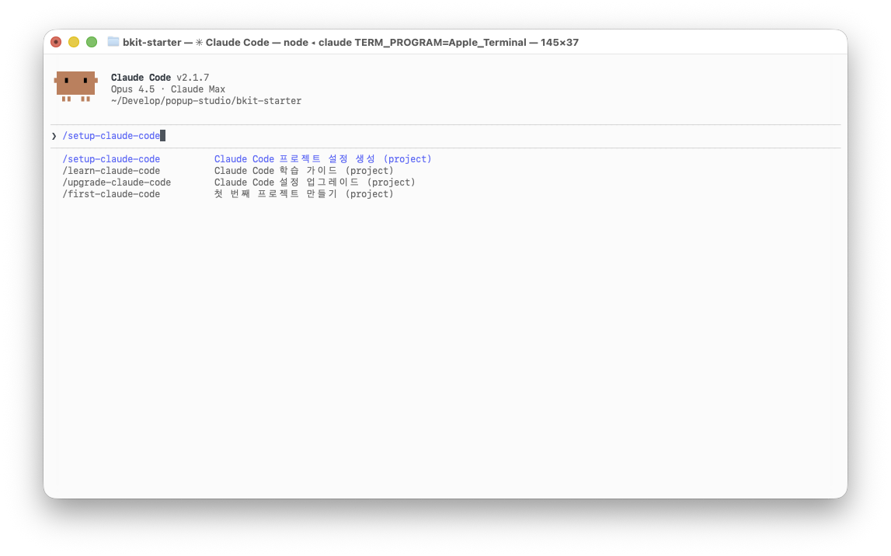
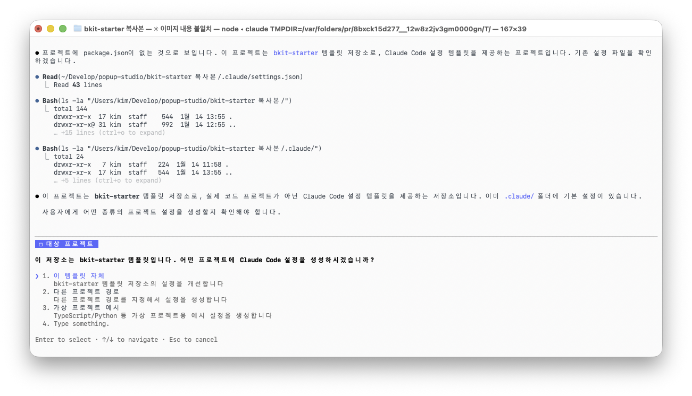

# Claude Code 빠른 시작 가이드

> 15분 안에 핵심 기능 파악하기

---

**📚 더 자세히 알고 싶으신가요?** → [완전 정복 가이드 (GUIDE.md)](GUIDE.md) - FAQ, 문제 해결, 고급 설정 포함

---

## 1. Claude Code란?

일반 AI 챗봇은 코드를 **알려주기만** 합니다.
Claude Code는 직접 **실행**합니다.

```
💬 "로그인 페이지 만들어줘"
→ 파일 생성, 코드 작성, 서버 실행까지 자동
```

---

## 2. 설치 확인

```bash
claude --version   # Claude Code v2.x.x 나오면 OK
node --version     # 없으면 nodejs.org에서 설치
```

---

## 3. 커맨드 4개

### /first-claude-code - 첫 체험

**대상**: "Claude Code가 뭔지 모르겠어요"

**데모**: [MBTI 포트폴리오](https://bkit-starter-mbti.netlify.app) | [쇼핑몰](https://bkit-starter-shop.netlify.app) | [할일 관리 앱](https://bkit-starter-todo.netlify.app) | [대시보드](https://bkit-starter-dashboard.netlify.app)


**하는 일**:
1. 만들고 싶은 것 질문 (포트폴리오, 쇼핑몰 등)
2. 스타일 질문 (미니멀, 다크 등)
3. 프로젝트 자동 생성
4. 개발 서버 실행
5. Claude Code 설정까지 완료

**결과**: 브라우저에서 바로 확인 가능한 웹사이트

---

### /learn-claude-code - 사용법 학습

**대상**: "제대로 배우고 싶어요"


**하는 일**:
1. 현재 프로젝트 설정 분석
2. 레벨 판정 (0~5)
3. 부족한 부분 안내
4. 레벨업 방법 제시

**레벨 시스템**:
```
레벨 0: 설정 없음
레벨 1: CLAUDE.md만 있음
레벨 2: Commands 또는 Hooks 추가
레벨 3: Agents 또는 Permissions 추가
레벨 4: Skills 또는 MCP 연결
레벨 5: 6개 이상 설정 완비
```

```bash
/learn-claude-code      # 현재 레벨 확인
/learn-claude-code 2    # 레벨 2 학습
```

---

### /setup-claude-code - 설정 생성

**대상**: "새 프로젝트에 설정 넣고 싶어요"




**하는 일**:
1. 프로젝트 분석 (언어, 프레임워크)
2. CLAUDE.md 생성 (규칙 파일)
3. Commands, Agents, Skills 생성
4. Hooks 설정 (자동 포맷팅 등)

**옵션**:
```bash
/setup-claude-code minimal   # CLAUDE.md + Hooks만
/setup-claude-code standard  # + Commands, Agents (권장)
/setup-claude-code full      # + Skills, MCP, GitHub Action
```

---

### /upgrade-claude-code - 트렌드 분석 & 업그레이드

**대상**: "최신 트렌드가 궁금해요" / "설정을 최신화하고 싶어요"


**하는 일**:
1. 현재 설정 분석
2. 웹 검색으로 최신 트렌드 조사
3. 개선점 제안
4. 사용자 승인 후 적용

**권장 주기**:
- 활발한 개발: 주 1회
- 유지보수: 월 1회

```bash
/upgrade-claude-code
```

---

## 4. 지금 바로 시작

```bash
# 1. 폴더 이동
cd ~/Desktop
mkdir my-first-project
cd my-first-project

# 2. Claude Code 실행
claude

# 3. 첫 프로젝트 만들기
/first-claude-code
```

---

## 5. 자주 하는 실수

| 실수 | 해결 |
|------|------|
| `command not found: claude` | `npm install -g @anthropic-ai/claude-code` |
| 슬래시 커맨드가 안 돼요 | Claude Code 안에서 입력해야 함 (터미널 아님) |
| 설정이 적용 안 돼요 | 프로젝트 루트에서 실행했는지 확인 |

---

## 다음 단계

- **상세 가이드**: [GUIDE.md](GUIDE.md) - FAQ, 문제 해결, 고급 설정
- **고급 사용자**: [bkit](https://github.com/popup-studio-ai/bkit-claude-code) - PDCA 방법론, 18개 커맨드

---

Made with ❤️ by [POPUP STUDIO](https://popupstudio.ai)
