# Claude Code 완전 정복 가이드

> 프로그래밍 경험 없이도 시작할 수 있는 AI 코딩 입문서

---

**⚡ 시간이 없으신가요?** → [빠른 시작 가이드 (GUIDE-QUICK.md)](GUIDE-QUICK.md) - 15분 안에 핵심만 파악

---

## 목차

1. [시작하기 전에](#1-시작하기-전에)
2. [첫 번째 프로젝트 만들기](#2-첫-번째-프로젝트-만들기-first-claude-code)
3. [Claude Code 배우기](#3-claude-code-배우기-learn-claude-code)
4. [프로젝트 설정하기](#4-프로젝트-설정하기-setup-claude-code)
5. [트렌드 분석 & 업그레이드](#5-트렌드-분석--업그레이드-upgrade-claude-code)
6. [자주 묻는 질문 (FAQ)](#6-자주-묻는-질문-faq)
7. [문제 해결](#7-문제-해결)
8. [다음 단계](#8-다음-단계)

---

## 1. 시작하기 전에

### 1.1 Claude Code란 무엇인가요?

**비유로 설명하면:**

| 일반 AI 챗봇 | Claude Code |
|-------------|-------------|
| 요리 레시피를 알려주는 친구 | 직접 요리까지 해주는 셰프 |
| "이렇게 하면 돼요" | "제가 해드릴게요" |
| 설명만 제공 | 실제 실행 |

Claude Code는 대화를 통해 **실제로**:
- 코드를 작성하고
- 파일을 수정하고
- 명령어를 실행합니다

### 1.2 설치 확인하기

터미널을 열고 다음 명령어를 입력하세요:

```bash
claude --version
```

**성공 시:**
```
Claude Code v2.x.x
```

**실패 시 (설치 필요):**
```bash
npm install -g @anthropic-ai/claude-code
```

### 1.3 필수 도구 확인

| 도구 | 확인 명령어 | 없으면? |
|------|------------|---------|
| Node.js | `node --version` | [nodejs.org](https://nodejs.org) 에서 LTS 다운로드 |
| Git | `git --version` | [git-scm.com](https://git-scm.com) 에서 다운로드 |

**Node.js 설치 확인:**
```bash
node --version
# v20.x.x 이상이면 OK
```

**Git 설치 확인:**
```bash
git --version
# git version 2.x.x 이면 OK
```

### 1.4 이 가이드가 해결하는 문제

| 문제 | 해결책 |
|------|--------|
| "Claude Code가 뭔지 모르겠어요" | `/first-claude-code`로 직접 체험 |
| "매번 같은 설명을 반복해야 해요" | CLAUDE.md에 규칙 저장 |
| "어디서부터 배워야 할지 모르겠어요" | `/learn-claude-code`로 레벨별 학습 |
| "설정하기 너무 복잡해요" | `/setup-claude-code`로 자동 생성 |
| "최신 기능을 놓치고 있는 것 같아요" | `/upgrade-claude-code`로 트렌드 확인 |

### 1.5 Claude Code 시작하기

```bash
# 프로젝트 폴더로 이동
cd /path/to/your-project

# Claude Code 시작
claude

# 또는 대화로 시작
claude "안녕하세요"
```

---

## 2. 첫 번째 프로젝트 만들기 (/first-claude-code)

### 2.1 이 커맨드는 뭘 하나요?

"Claude Code로 뭘 할 수 있어?"라는 질문에 답하면서 **실제로 동작하는 웹 프로젝트**를 만들어줍니다.

**결과물:**
- 완성된 웹사이트 (예: MBTI 포트폴리오)
- 개발 서버 실행 (http://localhost:3000)
- Claude Code 설정까지 자동 완료

**데모 사이트:**
| 프로젝트 | 데모 |
|----------|------|
| MBTI 포트폴리오 | [Live](https://bkit-starter-mbti.netlify.app) |
| 쇼핑몰 | [Live](https://bkit-starter-shop.netlify.app) |
| 할일 관리 앱 | [Live](https://bkit-starter-todo.netlify.app) |
| 대시보드 | [Live](https://bkit-starter-dashboard.netlify.app) |

### 2.2 실행 방법

```bash
/first-claude-code
```

### 2.3 단계별 진행 과정

#### Step 1: 인사 & 소개

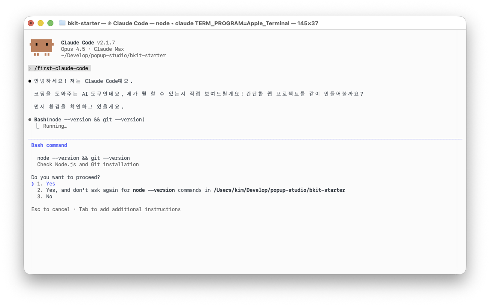

Claude가 먼저 인사합니다:

```
안녕하세요! 저는 Claude Code예요.

코딩을 도와주는 AI 도구인데요, 제가 뭘 할 수 있는지 직접 보여드릴게요!
간단한 웹 프로젝트를 같이 만들어볼까요?
```

#### Step 2: 만들고 싶은 것 선택

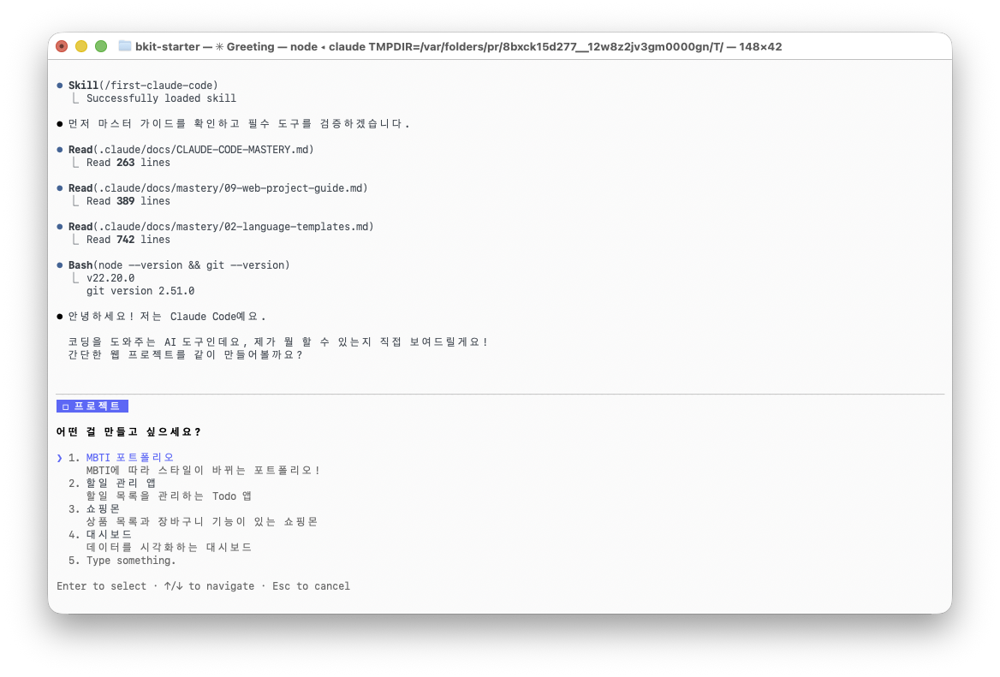

어떤 프로젝트를 만들지 선택합니다:

- MBTI 포트폴리오 (추천)
- 할일 관리 앱
- 쇼핑몰
- 대시보드
- 자유 입력

#### Step 3: 맞춤 질문

MBTI 포트폴리오를 선택하면 추가 질문이 나옵니다:

**1. MBTI는 뭔가요?** (예: INTJ, ENFP)

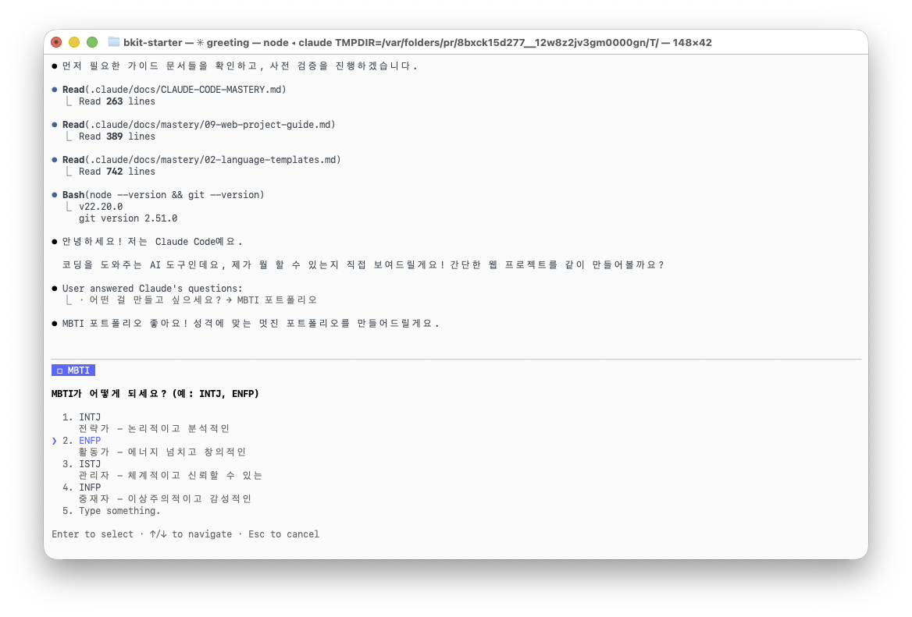

**2. 어떤 분야인가요?** (디자이너, 개발자, 마케터 등)

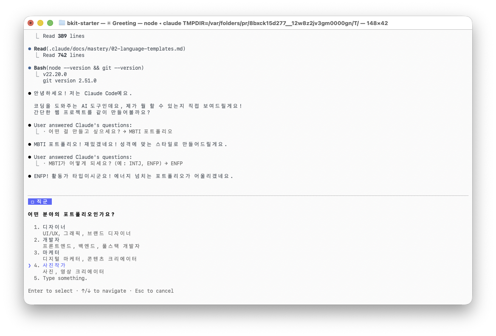

**3. 스타일은?** (미니멀, 모던, 레트로, 다크, 컬러풀)

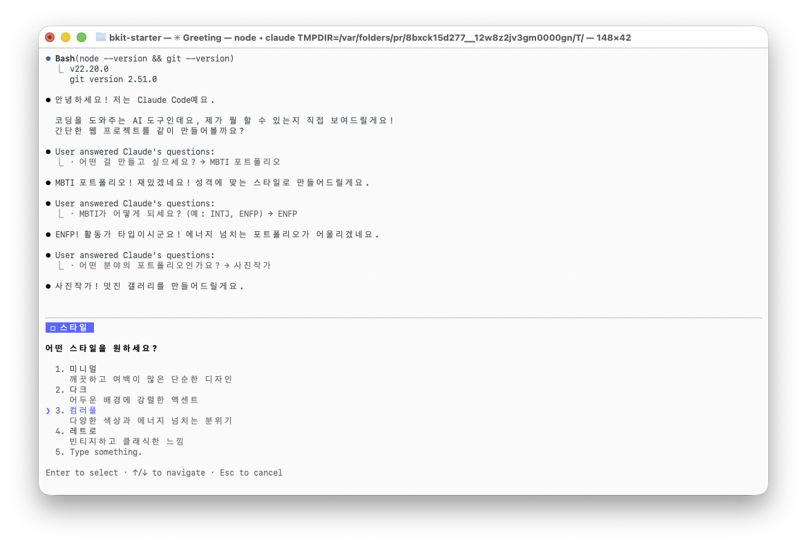

**4. 생성 방식은?** (자동 생성, 수동 생성)

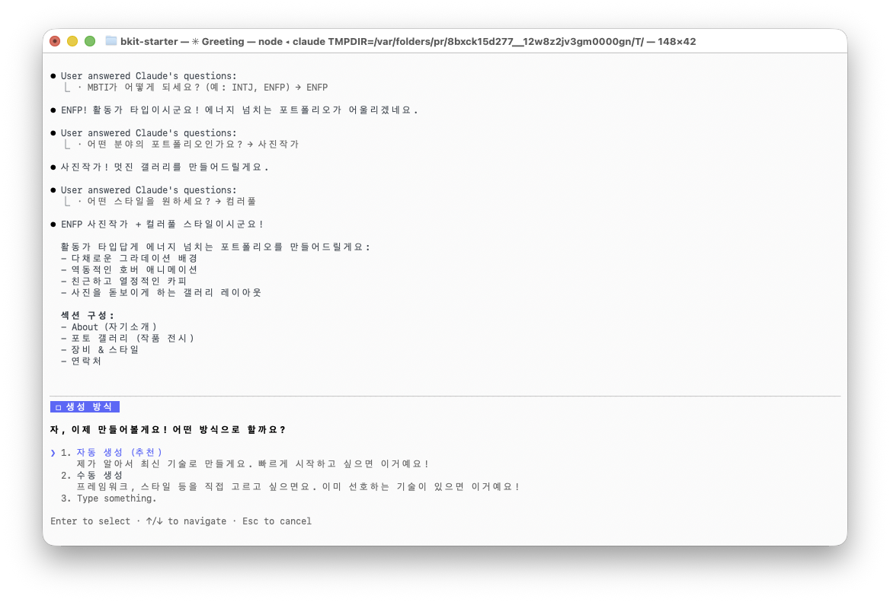

#### Step 4: 프로젝트 생성

Claude가 실시간으로 프로젝트를 만듭니다:

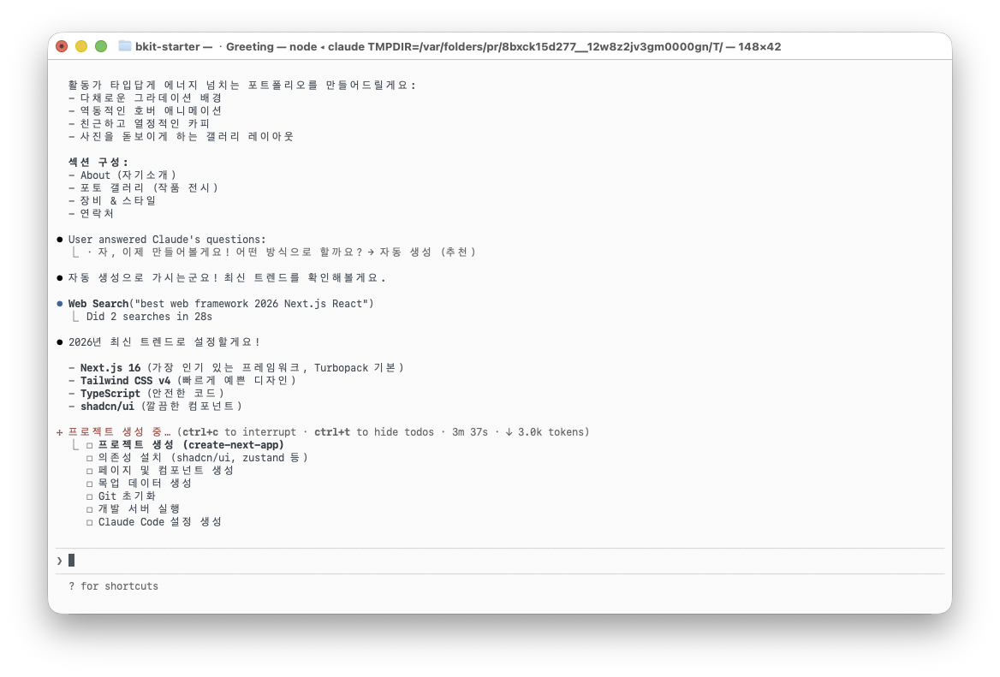

개발 서버가 실행되면:

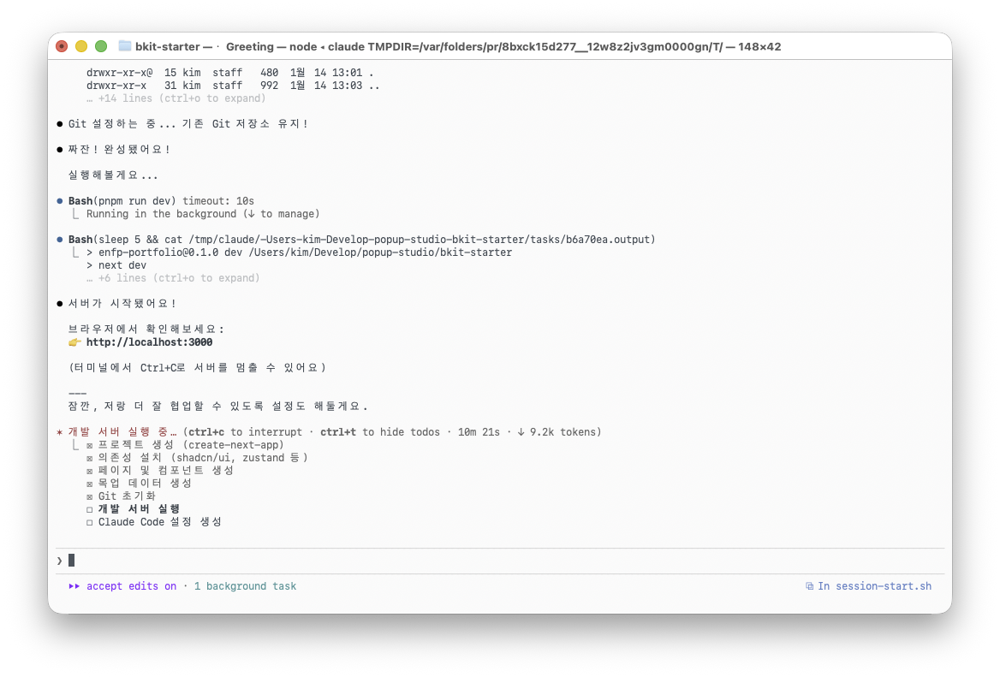

#### Step 5: 완성!

서버 실행 후 Claude Code 설정도 자동으로 진행합니다:

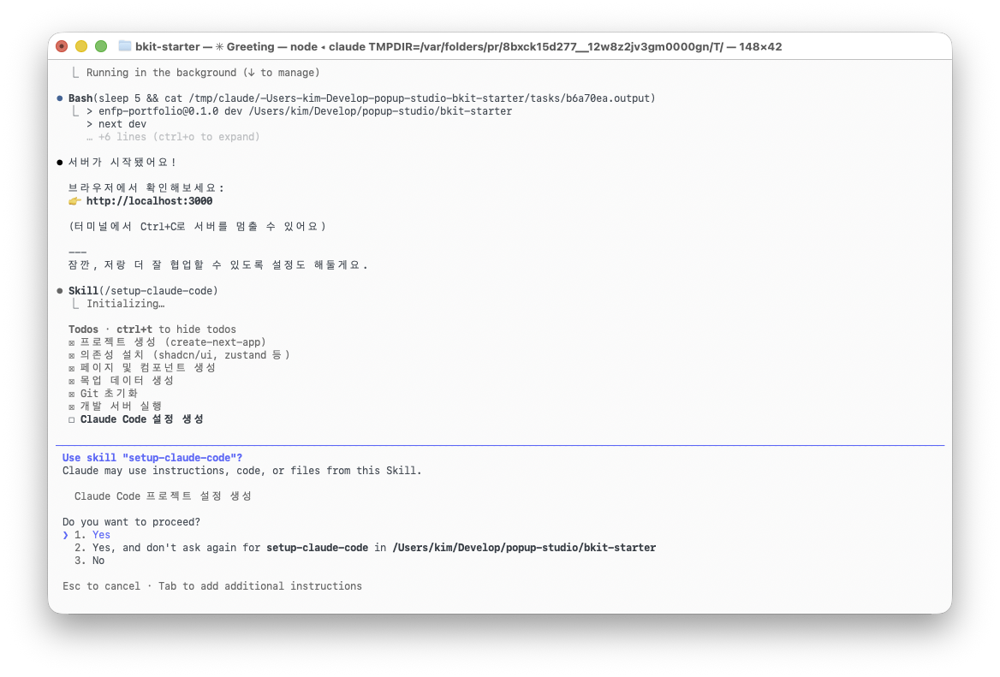

모든 설정이 완료되면 결과를 보여줍니다:

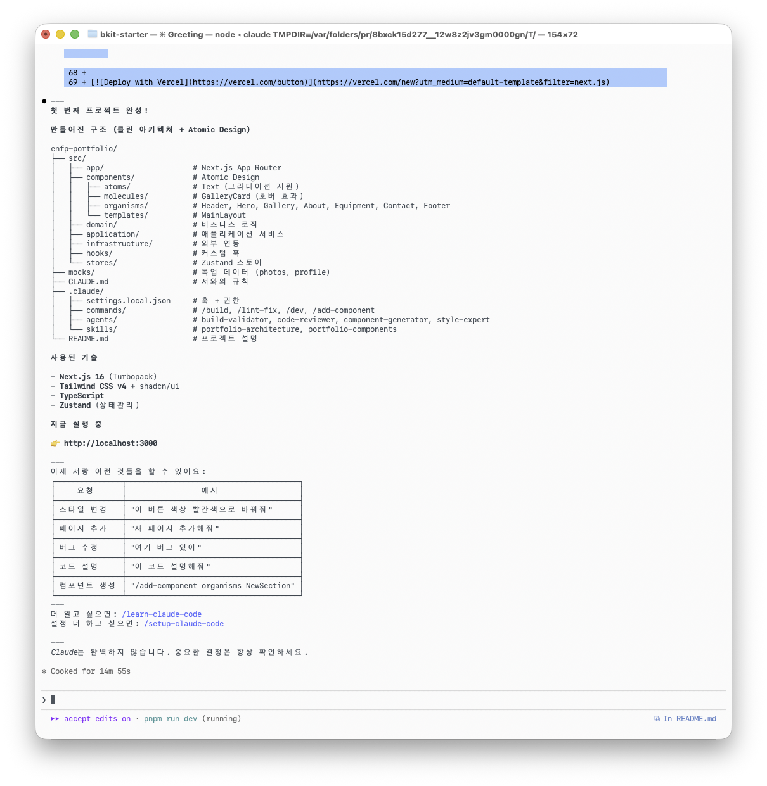

```
🎉 첫 번째 프로젝트 완성!

📁 만들어진 구조:
your-project/
├── src/
│   ├── app/                    # Next.js App Router
│   ├── components/             # UI 컴포넌트
│   └── ...
├── CLAUDE.md                   # 저와의 규칙
└── README.md                   # 프로젝트 설명

🚀 지금 실행 중:
👉 http://localhost:3000

(Ctrl+C로 서버를 멈출 수 있어요)
```

### 2.4 실패했을 때

**오류 메시지가 나오면:**

1. **Node.js 설치 확인:**
   ```bash
   node --version
   ```
   없으면 → [nodejs.org](https://nodejs.org)에서 설치

2. **Git 설치 확인:**
   ```bash
   git --version
   ```
   없으면 → [git-scm.com](https://git-scm.com)에서 설치

3. **인터넷 연결 확인**

4. **다시 시도:**
   ```bash
   /first-claude-code
   ```

**그래도 안 되면:**
- GitHub Issues에 문의: [링크]
- 에러 메시지 전체를 복사해서 올려주세요

### 2.5 완성 후 해볼 것들

이제 Claude와 대화로 프로젝트를 수정할 수 있습니다:

```
💬 "이 버튼 색상 빨간색으로 바꿔줘"
   → 바로 수정해드려요

💬 "새 페이지 추가해줘"
   → 바로 만들어드려요

💬 "여기 버그 있어"
   → 찾아서 고쳐드려요

💬 "이 코드 설명해줘"
   → 자세히 설명해드려요
```

---

## 3. Claude Code 배우기 (/learn-claude-code)

### 3.1 레벨 시스템 이해하기

Claude Code 설정은 레벨로 구분됩니다:

```
레벨 5 ▲ 완전체     (6개 이상 설정)
레벨 4 │ 고급       (Skills 또는 MCP)
레벨 3 │ 전문화     (Agents 또는 Permissions)
레벨 2 │ 자동화     (Commands 또는 Hooks)
레벨 1 │ 기초       (CLAUDE.md)
레벨 0 ▼ 빈 프로젝트 (설정 없음)
```

**레벨별 설명:**

| 레벨 | 이름 | 필수 조건 | 의미 |
|:----:|------|----------|------|
| 0 | 빈 프로젝트 | - | 아무 설정 없음 |
| 1 | 기초 | CLAUDE.md | 기본 규칙 정의됨 |
| 2 | 자동화 | Commands 또는 Hooks | 반복 작업 자동화됨 |
| 3 | 전문화 | Agents 또는 Permissions | 작업 전문화됨 |
| 4 | 고급 | Skills 또는 MCP | 도메인 지식 활용 |
| 5 | 완전체 | 6개 이상 | 팀 협업 최적화 |

### 3.2 실행 방법

```bash
/learn-claude-code        # 현재 레벨 분석
/learn-claude-code 1      # 레벨 1 학습
/learn-claude-code 2      # 레벨 2 학습
```

### 3.3 대시보드 읽는 법


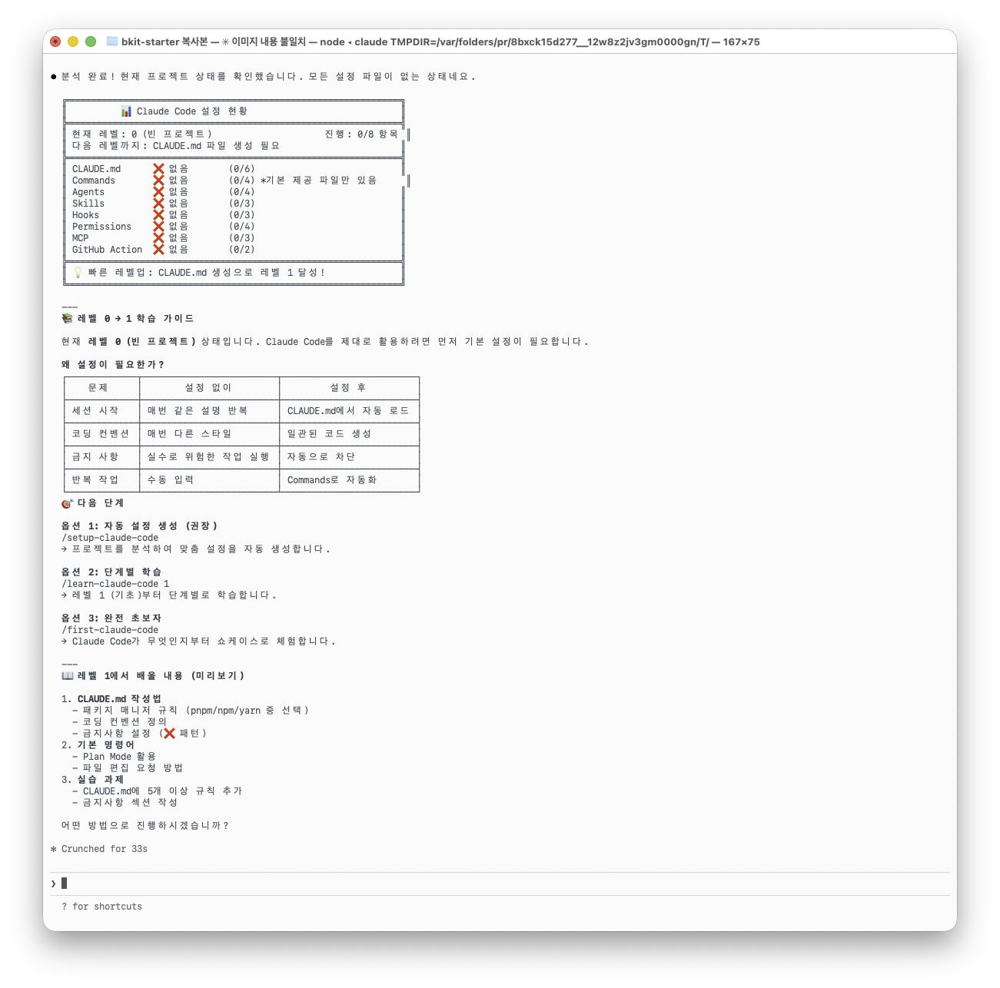


**기호 설명:**
- ✅ : 설정됨 (완료)
- ❌ : 미설정 (해야 함)
- (X/Y): X개 완료 / Y개 필요

### 3.4 각 항목 상세 설명

#### CLAUDE.md

프로젝트의 **규칙 파일**입니다. Claude가 이 파일을 읽고 프로젝트 규칙을 이해합니다.

**포함하면 좋은 내용:**
- 코딩 컨벤션
- 금지 사항
- 패키지 매니저 규칙
- 테스트 방법

**예시:**
```markdown
# Development Workflow

## 패키지 관리
- **항상 `pnpm` 사용** (`npm`, `yarn` 금지)

## 코딩 컨벤션
- `type` 선호, `interface` 자제
- **`enum` 절대 금지** → 문자열 리터럴 유니온 사용

## 금지 사항
- ❌ console.log 사용 (logger 사용)
- ❌ any 타입
- ❌ 테스트 없이 커밋
```

#### Commands (슬래시 커맨드)

반복 작업을 자동화하는 **커맨드 모음**입니다.

**예시:**
- `/commit` - 커밋 자동화
- `/test` - 테스트 실행
- `/build` - 빌드 실행
- `/lint-fix` - 린트 자동 수정

**위치:** `.claude/commands/`

#### Agents (서브 에이전트)

**전문가 역할**을 하는 AI입니다.

**예시:**
- `build-validator` - 빌드 검증
- `code-reviewer` - 코드 리뷰
- `test-runner` - 테스트 실행 분석
- `api-doc-generator` - API 문서 생성

**위치:** `.claude/agents/`

#### Skills (도메인 지식)

프로젝트 **도메인별 전문 지식**입니다.

**예시:**
- 프로젝트 아키텍처
- 테스트 패턴
- API 컨벤션
- 데이터베이스 규칙

**위치:** `.claude/skills/`

#### Hooks (자동 실행)

특정 이벤트 발생 시 **자동으로 실행**되는 규칙입니다.

**예시:**
- 파일 저장 시 → 자동 포맷팅
- 커밋 시 → 자동 검증
- 에러 발생 시 → 자동 분석

**위치:** `.claude/settings.local.json`

#### Permissions (권한 설정)

Claude가 실행할 수 있는 명령어를 **제한/허용**합니다.

**예시:**
```json
{
  "permissions": {
    "allow": ["Bash(git:*)", "Bash(pnpm:*)"],
    "deny": ["Bash(rm -rf /)"]
  }
}
```

#### MCP (외부 도구 연결)

**외부 도구와 연결**합니다.

**예시:**
- GitHub 연동
- Jira 연동
- 데이터베이스 연결
- Slack 알림

**위치:** `.mcp.json`

#### GitHub Action (CI/CD)

**자동화된 워크플로우**입니다.

**예시:**
- PR 자동 리뷰
- 문서 자동 업데이트
- 테스트 자동 실행

**위치:** `.github/workflows/`

### 3.5 레벨업 체크리스트

#### 레벨 0 → 1 (기초)

```bash
# CLAUDE.md 파일 생성
touch CLAUDE.md
```

체크리스트:
- [ ] CLAUDE.md 파일 생성
- [ ] 기본 규칙 5개 이상 추가
- [ ] 금지사항 섹션 추가 (❌ 사용)
- [ ] 코드 예시 포함 (``` 블록)

#### 레벨 1 → 2 (자동화)

```bash
# Commands 폴더 생성
mkdir -p .claude/commands
```

체크리스트:
- [ ] Commands 폴더 생성 + 커맨드 1개 이상
- [ ] 또는 Hooks 설정 (settings.local.json)

#### 레벨 2 → 3 (전문화)

```bash
# Agents 폴더 생성
mkdir -p .claude/agents
```

체크리스트:
- [ ] Agents 폴더 생성 + 에이전트 1개 이상
- [ ] 또는 Permissions 설정

#### 레벨 3 → 4 (고급)

```bash
# Skills 폴더 생성
mkdir -p .claude/skills
```

체크리스트:
- [ ] Skills 폴더 생성 + 스킬 1개 이상
- [ ] 또는 MCP 연결 (.mcp.json)

#### 레벨 4 → 5 (완전체)

체크리스트:
- [ ] 8개 항목 중 6개 이상 완성
- [ ] GitHub Action 추가 (선택)

---

## 4. 프로젝트 설정하기 (/setup-claude-code)

### 4.1 언제 사용하나요?

- 새 프로젝트를 시작할 때
- Claude Code 설정이 없는 프로젝트에
- 처음부터 제대로 설정하고 싶을 때

### 4.2 실행 방법

```bash
/setup-claude-code           # 자동 결정
/setup-claude-code minimal   # 최소 설정
/setup-claude-code standard  # 표준 설정 (권장)
/setup-claude-code full      # 전체 설정
```

### 4.3 옵션 비교

| 옵션 | CLAUDE.md | Commands | Agents | Skills | MCP | GitHub Action |
|------|:---------:|:--------:|:------:|:------:|:---:|:-------------:|
| minimal | ✅ | ❌ | ❌ | ❌ | ❌ | ❌ |
| standard | ✅ | ✅ | ✅ | ✅ | 선택 | ❌ |
| full | ✅ | ✅ | ✅ | ✅ | 선택 | ✅ |

**권장:**
- 개인 프로젝트: `minimal` 또는 `standard`
- 팀 프로젝트: `standard` 또는 `full`
- 대규모 프로젝트: `full`

### 4.4 생성되는 파일

```
your-project/
├── CLAUDE.md                 # 규칙 파일
├── .claude/
│   ├── settings.local.json   # 권한 + 훅
│   ├── commands/             # 슬래시 커맨드
│   │   ├── commit-push-pr.md
│   │   ├── typecheck-all.md
│   │   ├── test-module.md
│   │   ├── lint-fix.md
│   │   └── build-all.md
│   ├── agents/               # 서브 에이전트
│   │   ├── build-validator.md
│   │   ├── code-reviewer.md
│   │   ├── test-runner.md
│   │   └── api-doc-generator.md
│   └── skills/               # 도메인 지식
│       ├── {project}-architecture/
│       └── {project}-testing/
└── .mcp.json                 # MCP 설정 (선택 시)
```

### 4.5 실행 결과

```
✅ Claude Code 설정 완료!

📁 생성된 파일:
- CLAUDE.md ✅
- .claude/settings.local.json ✅
- .claude/commands/ (5개) ✅
- .claude/agents/ (4개) ✅
- .claude/skills/ (2개) ✅

📊 설정 규모: standard
🔧 기술 스택: TypeScript, pnpm, Next.js

🎯 다음 단계:
1. CLAUDE.md 내용 확인 및 수정
2. /learn-claude-code 로 사용법 학습
3. /upgrade-claude-code 로 최신 트렌드 확인
```

### 4.6 커스터마이징

생성된 파일은 자유롭게 수정할 수 있습니다:

**CLAUDE.md 수정:**
```bash
# 에디터로 열기
code CLAUDE.md
```

**커맨드 추가:**
```bash
# 새 커맨드 파일 생성
touch .claude/commands/my-command.md
```

---

## 5. 트렌드 분석 & 업그레이드 (/upgrade-claude-code)

### 5.1 왜 정기적으로 해야 하나요?

AI 도구는 빠르게 변화합니다:
- 새로운 기능 추가
- 베스트 프랙티스 변경
- 보안 업데이트

**권장 주기:**

| 프로젝트 상태 | 권장 주기 |
|--------------|----------|
| 활발한 개발 | 주 1회 |
| 유지보수 | 월 1회 |
| 안정화 | 분기 1회 |

### 5.2 실행 방법

```bash
/upgrade-claude-code
```

### 5.3 결과 예시


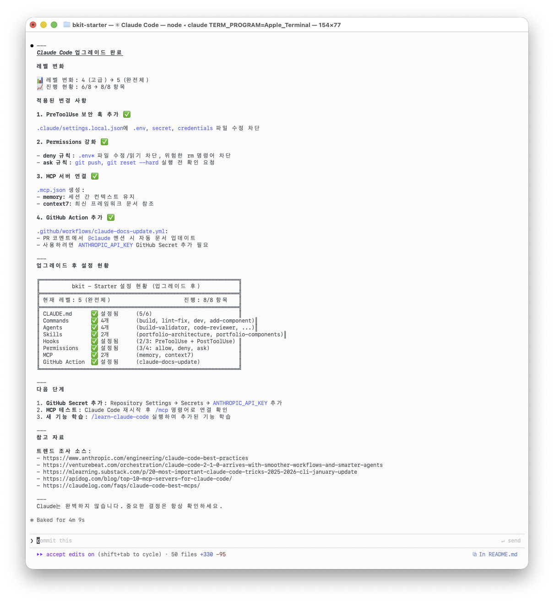

```
🚀 Claude Code 업그레이드 완료!

📊 레벨 변화: 2 (자동화) → 3 (전문화)
📈 진행 현황: 4/8 → 6/8 항목

📝 적용된 변경:
- Skills 폴더 생성 (2개) ✅
- CLAUDE.md 규칙 추가 ✅
- 새 MCP 서버 연결 (MongoDB) ✅

🔥 반영된 최신 트렌드:
- Claude Code 2.1.1 새 기능 반영
- MCP 서버 추천 업데이트
- 보안 권한 설정 강화

🎯 다음 단계:
- 새로운 설정 테스트
- 팀원과 공유
- /learn-claude-code 로 새 기능 학습
```

### 5.4 트렌드 분석 결과 읽기

업그레이드 시 트렌드 분석 결과가 표시됩니다:

```
🔥 년도 트렌드 (2026):
| 트렌드 | 설명 | 적용 권장 |
|--------|------|:--------:|
| MCP 연동 확대 | 외부 도구 연결 강화 | 높음 |
| Skills 활용 | 도메인 지식 체계화 | 중간 |

⚡ 월간 트렌드 (1월):
| 업데이트 | 날짜 | 영향도 |
|----------|------|:------:|
| Claude Code 2.1.1 | 2026-01-10 | 높음 |
| 새 MCP 서버 출시 | 2026-01-08 | 중간 |

📢 주간 핫토픽:
- 🔥 [높음] PostToolUse 훅 개선
- ⚡ [중간] 권한 설정 간소화
- 📢 [정보] 새 커맨드 패턴 공유
```

### 5.5 롤백 방법

업그레이드가 마음에 안 들면 되돌릴 수 있습니다:

```bash
# Git으로 이전 상태로 되돌리기
git checkout HEAD~1 -- .claude/
git checkout HEAD~1 -- CLAUDE.md
git checkout HEAD~1 -- .mcp.json
```

---

## 6. 자주 묻는 질문 (FAQ)

### 설치 관련

**Q: 프로그래밍을 전혀 몰라도 되나요?**

A: 네! `/first-claude-code`는 완전 초보자도 사용할 수 있도록 설계되었습니다. 질문에 답하기만 하면 Claude가 알아서 프로젝트를 만들어줍니다.

---

**Q: 어떤 운영체제에서 사용할 수 있나요?**

A: macOS, Windows, Linux 모두 지원합니다. 터미널(또는 명령 프롬프트)만 있으면 됩니다.

---

**Q: Node.js는 어떻게 설치하나요?**

A: [nodejs.org](https://nodejs.org)에서 LTS 버전을 다운로드하세요.

**macOS:**
```bash
# Homebrew로 설치
brew install node
```

**Windows:**
- nodejs.org에서 설치 프로그램 다운로드

---

**Q: 설치 후 바로 사용할 수 있나요?**

A: 네! 설치 후 터미널에서 다음 명령어로 시작하세요:
```bash
claude
```

---

**Q: 업데이트는 어떻게 하나요?**

A:
```bash
npm update -g @anthropic-ai/claude-code
```

### 사용법 관련

**Q: 슬래시 커맨드는 어디서 실행하나요?**

A: Claude Code가 실행된 터미널에서 `/커맨드명`을 입력하세요. 예:
```
/first-claude-code
/learn-claude-code
```

---

**Q: CLAUDE.md는 꼭 만들어야 하나요?**

A: 필수는 아니지만, 만들면 Claude가 더 정확하게 도와줍니다. 프로젝트 규칙을 한 번만 적어두면 매번 설명할 필요가 없어요.

---

**Q: 여러 프로젝트에서 같은 설정을 쓸 수 있나요?**

A: 네! `.claude` 폴더를 복사하면 됩니다:
```bash
cp -r project-a/.claude project-b/
```

---

**Q: 팀원과 설정을 공유할 수 있나요?**

A: 네! `.claude` 폴더를 Git에 커밋하면 팀 전체가 사용할 수 있습니다:
```bash
git add .claude/
git commit -m "Add Claude Code settings"
```

---

**Q: 커맨드를 직접 만들 수 있나요?**

A: 네! `.claude/commands/` 폴더에 `.md` 파일을 추가하세요:
```bash
# 새 커맨드 파일 생성
touch .claude/commands/my-command.md
```

### 비용 관련

**Q: 무료인가요?**

A: 이 Starter는 무료입니다. Claude Code 자체는 Anthropic API 비용이 발생합니다.

---

**Q: API 비용은 얼마나 드나요?**

A: 사용량에 따라 다릅니다. [Anthropic 가격 페이지](https://www.anthropic.com/pricing)를 확인하세요.

---

**Q: 무료 체험이 있나요?**

A: Anthropic에서 제공하는 무료 크레딧이 있을 수 있습니다. 공식 사이트를 확인하세요.

### bkit 비교

**Q: bkit과 뭐가 다른가요?**

A:

| 항목 | bkit-starter | bkit |
|------|---------------------|------|
| 대상 | 초보자 | 중급/고급 |
| 언어 | 한글 | 다국어 (8개) |
| 방법론 | 학습 중심 | PDCA 워크플로우 |
| 커맨드 | 4개 | 18개 |
| Skills | - | 24개 |
| Agents | - | 11개 |

---

**Q: bkit으로 언제 넘어가야 하나요?**

A: 레벨 4 이상이 되면 bkit의 고급 기능이 도움이 됩니다. bkit은:
- PDCA 방법론으로 체계적인 개발
- 18개 전문 커맨드
- 24개 도메인 스킬
- 11개 전문 에이전트
- 다국어 지원 (8개 언어)

```bash
# bkit 설치
/plugin install bkit
```

---

## 7. 문제 해결

### 7.1 흔한 오류

#### "command not found: claude"

**원인:** Claude Code가 설치되지 않음

**해결:**
```bash
npm install -g @anthropic-ai/claude-code
```

---

#### "CLAUDE.md not found"

**원인:** 프로젝트 루트에 CLAUDE.md가 없음

**해결:**
```bash
/setup-claude-code
```
또는 직접 생성:
```bash
touch CLAUDE.md
```

---

#### "Permission denied"

**원인:** 권한 설정 문제

**해결:** `.claude/settings.local.json`의 permissions 확인:
```json
{
  "permissions": {
    "allow": ["Bash(git:*)", "Bash(npm:*)"]
  }
}
```

---

#### "Network error"

**원인:** 인터넷 연결 문제

**해결:**
1. 인터넷 연결 확인
2. VPN 사용 중이면 끄기
3. 다시 시도

---

#### "API key invalid"

**원인:** Anthropic API 키 문제

**해결:**
```bash
claude config set api-key YOUR_API_KEY
```

---

#### "Hook failed"

**원인:** 훅 실행 중 오류

**해결:** `.claude/settings.local.json`의 hooks 확인:
```json
{
  "hooks": {
    "PostToolUse": [
      {
        "matcher": "Write|Edit",
        "hooks": [
          {
            "type": "command",
            "command": "npx prettier --write $FILE || true"
          }
        ]
      }
    ]
  }
}
```

---

#### "Command not recognized"

**원인:** 커맨드 파일이 없거나 형식이 잘못됨

**해결:**
1. `.claude/commands/` 폴더 확인
2. 파일 확장자가 `.md`인지 확인
3. 파일 내용이 마크다운 형식인지 확인

---

#### "MCP connection failed"

**원인:** MCP 서버 연결 실패

**해결:**
1. `.mcp.json` 문법 확인
2. 환경 변수 설정 확인
3. MCP 서버 상태 확인

---

#### "Out of memory"

**원인:** 컨텍스트가 너무 큼

**해결:**
1. 세션 새로 시작
2. CLAUDE.md 규칙 줄이기 (150-200개 이하 권장)

---

#### "Rate limit exceeded"

**원인:** API 호출 한도 초과

**해결:**
1. 잠시 기다린 후 재시도
2. API 사용량 확인

### 7.2 로그 확인 방법

```bash
# Claude Code 로그 위치
~/.claude/logs/

# 최근 로그 보기
tail -f ~/.claude/logs/claude.log

# 에러 로그만 보기
grep -i error ~/.claude/logs/claude.log
```

### 7.3 도움 요청 방법

1. **GitHub Issues**: [https://github.com/popup-studio-ai/bkit-starter/issues](https://github.com/popup-studio-ai/bkit-starter/issues)

2. **이메일**: contact@popupstudio.ai

**도움 요청 시 포함할 정보:**
- Claude Code 버전: `claude --version`
- Node.js 버전: `node --version`
- 운영체제
- 에러 메시지 전체
- 재현 방법

---

## 8. 다음 단계

### 8.1 bkit으로 마이그레이션

bkit-starter를 마스터했다면 bkit으로 업그레이드하세요:

```bash
/plugin install bkit
```

**bkit의 추가 기능:**

| 기능 | 설명 |
|------|------|
| PDCA 방법론 | Plan-Do-Check-Act 체계적 개발 |
| 18개 커맨드 | init, pdca-plan, pdca-design, ... |
| 24개 스킬 | 도메인별 전문 지식 |
| 11개 에이전트 | 전문가 역할 AI |
| 다국어 지원 | 8개 언어 (영/한/일/중/스/프/독/이) |
| 프로젝트 레벨 | Starter, Dynamic, Enterprise |

### 8.2 고급 기능 탐색

#### Skills 만들기

```bash
mkdir -p .claude/skills/my-skill
touch .claude/skills/my-skill/SKILL.md
```

**SKILL.md 템플릿:**
```yaml
---
name: my-skill
description: 내 스킬 설명
---

# My Skill

## 개요
[설명]

## 핵심 파일
[경로]

## 핵심 규칙
[규칙]
```

#### MCP 연결하기

```bash
# MCP 서버 추가
claude mcp add github

# 상태 확인
/mcp
```

#### Hooks 설정하기

`.claude/settings.local.json`:
```json
{
  "hooks": {
    "PostToolUse": [
      {
        "matcher": "Write|Edit",
        "hooks": [
          {
            "type": "command",
            "command": "npx prettier --write $FILE || true"
          }
        ]
      }
    ]
  }
}
```

#### GitHub Action 설정하기

`.github/workflows/claude-review.yml`:
```yaml
name: Claude Review
on: [pull_request]
jobs:
  review:
    runs-on: ubuntu-latest
    steps:
      - uses: actions/checkout@v4
      - uses: anthropics/claude-code-action@v1
        with:
          anthropic-api-key: ${{ secrets.ANTHROPIC_API_KEY }}
```

### 8.3 커뮤니티 참여

- **GitHub에 Star 주기**: [bkit-starter](https://github.com/popup-studio-ai/bkit-starter)
- **Issues에 피드백 남기기**: 개선 아이디어, 버그 리포트
- **PR로 기여하기**: 문서 개선, 새 기능 제안

---

## 부록: 참고 자료

### 공식 문서
- [Claude Code 공식 문서](https://code.claude.com/docs)
- [Anthropic 블로그](https://www.anthropic.com/engineering)
- [MCP 서버 목록](https://github.com/modelcontextprotocol/servers)

### 커뮤니티
- [Reddit r/ClaudeAI](https://reddit.com/r/ClaudeAI)
- [Anthropic Discord](https://discord.gg/anthropic)

### 관련 프로젝트
- [bkit-claude-code](https://github.com/popup-studio-ai/bkit-claude-code) - 고급 확장 버전

### 추천 글
- [Boris Cherny's 13 Tips](https://howborisusesclaudecode.com/)
- [Claude Code Best Practices](https://www.anthropic.com/engineering/claude-code-best-practices)
- [Writing a Good CLAUDE.md](https://www.humanlayer.dev/blog/writing-a-good-claude-md)

---

Made with ❤️ by [POPUP STUDIO](https://popupstudio.ai)
