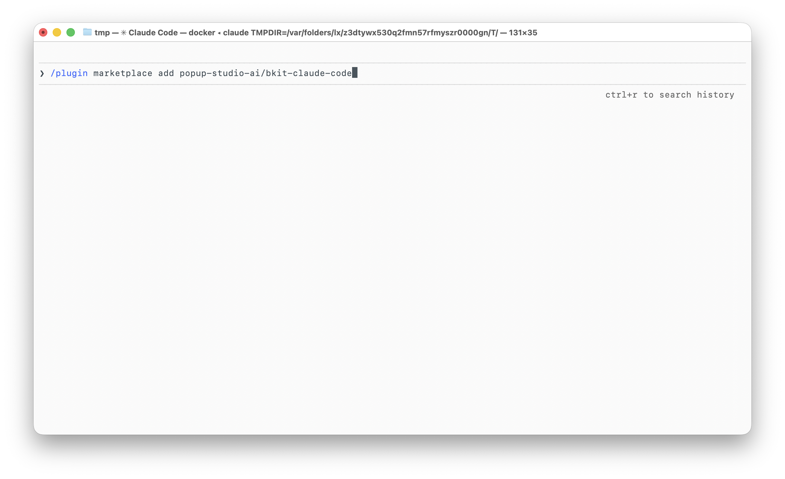
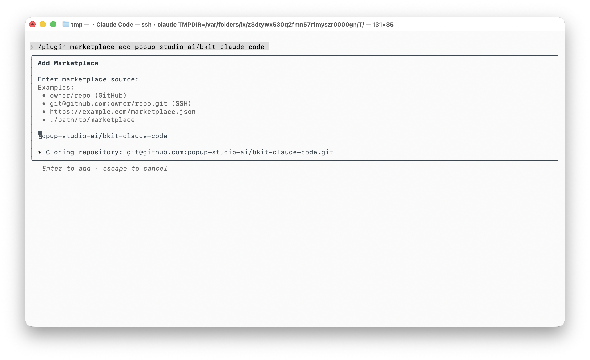
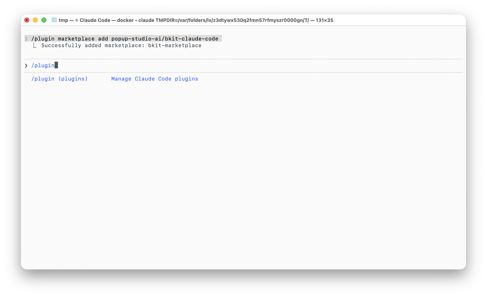
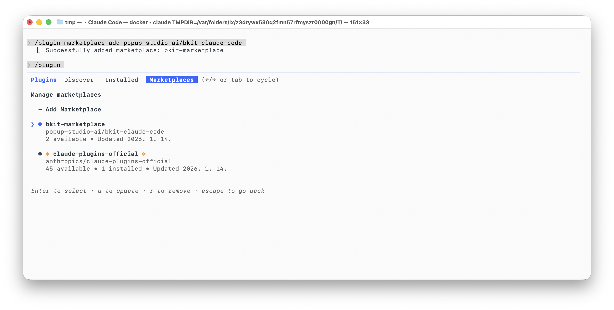
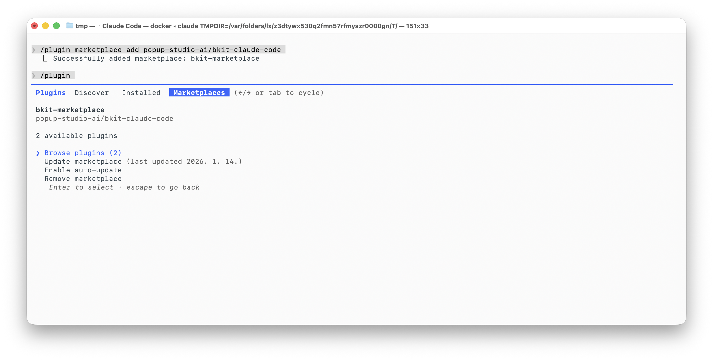
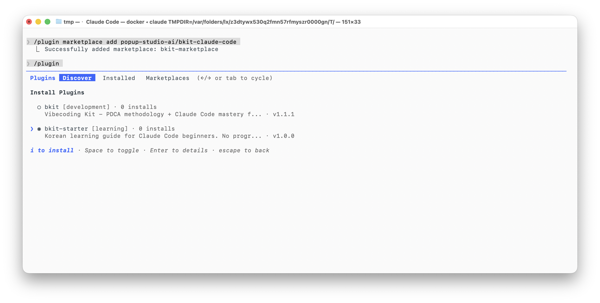
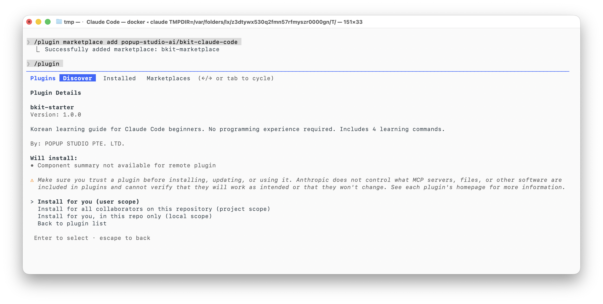
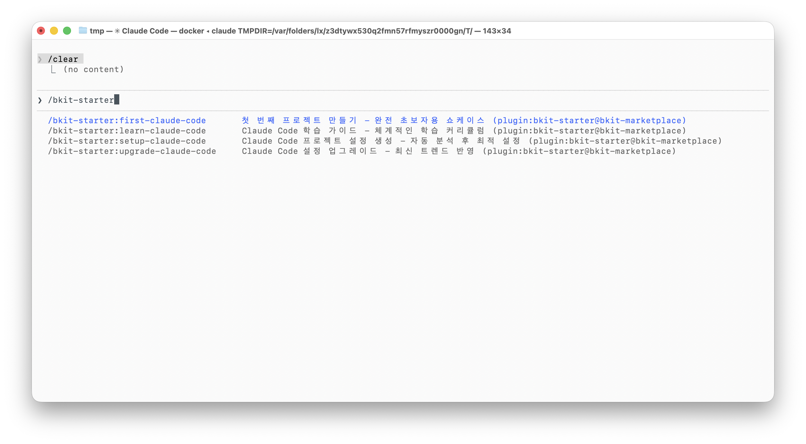

# 상세 설치 가이드

> 처음 플러그인을 설치하시는 분들을 위한 단계별 가이드입니다.
>
> 천천히 따라하시면 됩니다!

---

## 알아두면 좋은 것

Claude Code의 플러그인 시스템은 **마켓플레이스**와 **플러그인**으로 구성됩니다.

| 용어 | 설명 | 비유 |
|------|------|------|
| **Marketplace** | 플러그인을 모아둔 저장소 | 앱스토어 |
| **Plugin** | 실제로 설치해서 사용하는 기능 | 앱 |
| **Installed** | 내가 설치한 플러그인 목록 | 내 앱 목록 |

**설치 흐름:**
```
마켓플레이스 추가 → 플러그인 찾기 → 설치 → 사용
```

> 💡 마켓플레이스를 한 번 추가하면, 그 안의 플러그인들을 자유롭게 설치/삭제할 수 있습니다.

---

## Step 1. 마켓플레이스 추가 명령어 입력

Claude Code에서 아래 명령어를 **그대로** 입력하고 **Enter**를 누릅니다:

```bash
/plugin marketplace add popup-studio-ai/bkit-claude-code
```



---

## Step 2. 마켓플레이스 추가 확인

`popup-studio-ai/bkit-claude-code`가 자동으로 선택되어 있습니다.

1. **Enter** 키를 눌러 추가합니다

> 💡 `Cloning repository...` 메시지가 나오면서 자동으로 추가됩니다.



---

## Step 3. 플러그인 관리 화면 열기

마켓플레이스가 추가되었습니다. 이제 플러그인을 설치해야 합니다.

1. `/plugin`을 입력합니다
2. **Enter** 키를 눌러 플러그인 관리 화면을 엽니다



---

## Step 4. Marketplaces 탭으로 이동

플러그인 관리 화면이 열렸습니다.

1. **→ 방향키**를 눌러 **Marketplaces** 탭으로 이동합니다
   - `Plugins` → `Discover` → `Installed` → `Marketplaces`
   - 또는 **Tab** 키를 눌러도 됩니다
2. `bkit-marketplace`가 목록에 보이는지 확인합니다
3. **↓ 방향키**로 `bkit-marketplace`를 선택합니다
4. **Enter** 키를 누릅니다



---

## Step 5. Browse plugins 선택

`bkit-marketplace` 상세 화면입니다.

1. **Browse plugins (2)** 가 선택되어 있는지 확인합니다
2. **Enter** 키를 눌러 플러그인 목록을 봅니다



---

## Step 6. bkit-starter 선택하고 설치

**Discover** 탭에서 설치 가능한 플러그인 목록이 보입니다.

| 플러그인 | 설명 |
|----------|------|
| `bkit` | 고급 사용자용 (PDCA 방법론) |
| `bkit-starter` | **초보자용 학습 가이드** ← 이걸 설치합니다 |

1. **↓ 방향키**로 `bkit-starter`를 선택합니다
2. **i** 키를 눌러 설치를 시작합니다

> 💡 화면 하단에 `i to install`이라고 안내가 나옵니다.



---

## Step 7. 설치 범위 선택

설치 범위를 선택하는 화면입니다.

| 옵션 | 설명 |
|------|------|
| **Install for you (user scope)** | 내 모든 프로젝트에서 사용 **(권장)** |
| Install for all collaborators (project scope) | 팀 전체가 사용 |
| Install for you, in this repo only (local scope) | 현재 프로젝트에서만 사용 |

1. **Install for you (user scope)** 가 이미 선택되어 있습니다
2. 그대로 **Enter** 키를 눌러 설치합니다

> 💡 user scope로 설치하면 어떤 프로젝트에서든 bkit-starter를 사용할 수 있습니다!



---

## Step 8. 설치 완료! 🎉

축하합니다! 설치가 완료되었습니다.

이제 `/bkit-starter`를 입력하면 사용 가능한 커맨드들이 표시됩니다:

| 커맨드 | 설명 |
|--------|------|
| `/bkit-starter:first-claude-code` | 첫 프로젝트 만들기 |
| `/bkit-starter:learn-claude-code` | 사용법 학습 |
| `/bkit-starter:setup-claude-code` | 설정 생성 |
| `/bkit-starter:upgrade-claude-code` | 업그레이드 |

1. `/bkit-starter`를 입력해보세요
2. **↓ 방향키**로 원하는 커맨드를 선택합니다
3. **Enter** 키를 눌러 실행합니다



---

## 설치 확인

설치가 완료되면 설정 파일에 다음과 같이 저장됩니다:

| 설치 범위 | 저장 위치 |
|-----------|-----------|
| user scope | `~/.claude/settings.json` |
| project scope | `.claude/settings.json` |
| local scope | `.claude/settings.local.json` |

```json
{
  "enabledPlugins": {
    "bkit-starter@bkit-marketplace": true
  }
}
```


---

## 키보드 단축키 정리

| 키 | 동작 |
|----|------|
| **↑ ↓** | 목록에서 위/아래로 이동 |
| **← →** | 탭 간 이동 |
| **Tab** | 다음 탭으로 이동 |
| **Enter** | 선택/확인 |
| **i** | 플러그인 설치 |
| **Space** | 체크박스 토글 |
| **Esc** | 뒤로 가기/취소 |

---

## 문제 해결

### 플러그인이 보이지 않아요

1. `/plugin`을 입력하고 Enter
2. **→ 방향키**로 **Marketplaces** 탭으로 이동
3. `bkit-marketplace`가 있는지 확인
4. 없다면 Step 1부터 다시 시작

### 커맨드가 작동하지 않아요

1. `/plugin`을 입력하고 Enter
2. **→ 방향키**로 **Installed** 탭으로 이동
3. `bkit-starter`가 **enabled** 상태인지 확인
4. **Space** 키로 활성화/비활성화 토글

### 잘 모르겠어요

Claude Code에서 **"안녕"** 이라고 입력해보세요! 자동으로 안내가 시작됩니다.

---

[← README로 돌아가기](README.md)
