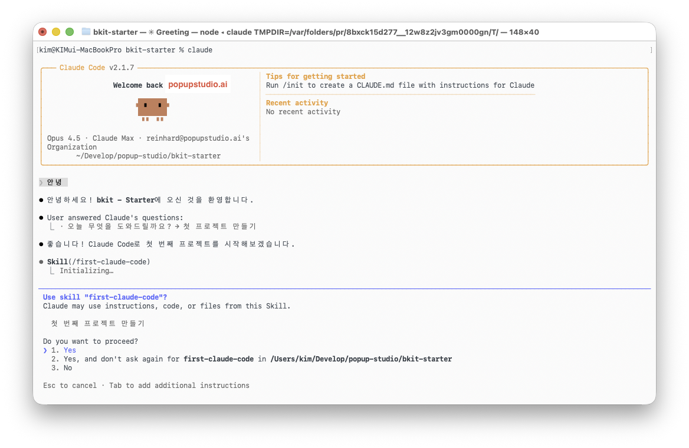

# bkit - Starter

> **AI 코딩 도구를 처음 접하는 분들을 위한 한글 가이드**

[](LICENSE)
[](https://code.claude.com)
[](GUIDE-QUICK.md)
[]()

---

## 🚀 처음 오셨나요?

**Claude Code가 처음이시라면** 아래 가이드 중 하나를 선택하세요:

| 📖 | 가이드 | 설명 |
|:--:|--------|------|
| ⚡ | **[빠른 시작](GUIDE-QUICK.md)** | 15분 안에 핵심만 파악 |
| 📚 | **[완전 정복](GUIDE.md)** | 상세 설명, FAQ, 문제 해결 |

---

## 이게 뭔가요?

Claude Code는 AI가 직접 코드를 작성하고 실행하는 도구입니다.

이 Starter는 **처음 시작하는 분들**을 위해:

- **완전한 한글 가이드** 제공
- **원클릭 설정** 지원
- **단계별 학습** 커리큘럼
- **실제 프로젝트** 생성 체험

### 데모

`/first-claude-code`로 만들 수 있는 프로젝트:

| 프로젝트 | 데모 | 설명 |
|----------|------|------|
| MBTI 포트폴리오 | [Live](https://bkit-starter-mbti.netlify.app) | 성격에 맞는 맞춤 포트폴리오 |
| 쇼핑몰 | [Live](https://bkit-starter-shop.netlify.app) | 상품 목록 + 장바구니 |
| 할일 관리 앱 | [Live](https://bkit-starter-todo.netlify.app) | 깔끔한 Todo 앱 |
| 대시보드 | [Live](https://bkit-starter-dashboard.netlify.app) | 데이터 시각화 |

---

### 🚀 고급 사용자라면?

> **이미 Claude Code에 익숙하신가요?**
>
> [bkit-claude-code](https://github.com/popup-studio-ai/bkit-claude-code)로 업그레이드하세요!
>
> - PDCA 방법론으로 체계적인 개발
> - 18개 전문 커맨드
> - 24개 스킬, 11개 에이전트
>
> ```bash
> /plugin install bkit
> ```
>
> bkit-starter를 마스터한 후 사용하는 고급 확장 버전입니다.

---

## 설치

```bash
# 1. 마켓플레이스 추가
/plugin marketplace add popup-studio-ai/bkit-claude-code

# 2. 플러그인 설치
/plugin install bkit-starter
```

> 처음이신가요? [상세 설치 가이드](INSTALL.md)를 참고하세요.

---

## 슬래시 커맨드

| 커맨드 | 설명 | 대상 |
|--------|------|------|
| `/first-claude-code` | 첫 프로젝트 만들기 | 완전 초보자 |
| `/learn-claude-code` | 사용법 학습 | 배우고 싶은 분 |
| `/setup-claude-code` | 설정 자동 생성 | 새 프로젝트 |
| `/upgrade-claude-code` | 트렌드 분석 & 업그레이드 | 기존 프로젝트 |

### 뭘 해야 할지 모르겠다면? 인사하세요!

**안녕** 이라고 인사해보세요. 자동으로 첫 프로젝트 만들기가 시작됩니다.



---

## 가이드

| 시간 없어요                           | 자세히 알고 싶어요 |
|----------------------------------|-------------------|
| [GUIDE-QUICK.md](GUIDE-QUICK.md) | [GUIDE.md](GUIDE.md) |
| [15분 안에 시작](GUIDE-QUICK.md)      | [완전한 한글 가이드](GUIDE.md) |
| [핵심만 빠르게](GUIDE-QUICK.md)        | [FAQ, 문제 해결 포함](GUIDE.md) |

---

## 구조

```
.claude/
├── commands/           # 슬래시 커맨드
│   ├── first-claude-code.md   # 첫 프로젝트 만들기
│   ├── learn-claude-code.md   # 사용법 학습
│   ├── setup-claude-code.md   # 설정 자동 생성
│   └── upgrade-claude-code.md # 트렌드 분석 & 업그레이드
└── settings.local.json
```

---

## 포함된 가이드

| 가이드 | 내용 |
|--------|------|
| Settings Guide | settings.json, CLAUDE.md 설정 방법 |
| Language Templates | 언어별 CLAUDE.md 템플릿 |
| Project Structures | 프로젝트 유형별 구조 예시 |
| Curriculum | 단계별 학습 커리큘럼 (레벨 0-5) |
| Advanced | 고급 기능 (Hooks, MCP 등) |
| Plugins | 플러그인 시스템 |
| Output Styles | 응답 스타일 커스터마이징 |
| Programmatic | SDK/API 활용 |
| Web Project Guide | 웹 프로젝트 생성 상세 가이드 |

---

## 기여

이슈와 PR을 환영합니다!

- [Issues](https://github.com/popup-studio-ai/bkit-starter/issues)
- [Pull Requests](https://github.com/popup-studio-ai/bkit-starter/pulls)

---

## 라이선스

MIT License - [LICENSE](LICENSE)

---

Made with ❤️ by [POPUP STUDIO](https://popupstudio.ai)
